# Project
For our project we wanted to see how different iterative / direkt solvers compare to the existing SOR solver.

We decided to implement an Multigrid (with V-cycle) as well as an CG solver and also use an LU direkt solver from the C++ library **Eigen**.


*Short comparison*: 
- Scenario: Cavity100
- Grid size 63x63
- Itermax: 100000
- Epsilon: 0.001

For the calculation of the first timestep we get following results:

| Solver | runtime | iterations | complexity/iteration |
| ---      |  ------  |---- | ----- |
| SOR | 2.350s | 6938 | O(N²) |
| Multigrid (3 levels) | 1.953s |  135 | O((a+ N*(1/lmax)³)*N²) |
| CG | 0.106s | 96 | O(N²) |
| LU | 0.022s | - | O(N³) |


See section [Iterative solvers](#iterative-solvers) for more information on the different solvers and their usage.

# Notable Changes
- Simulation routine moved from `main.cpp` into a seperate file `simulation.cpp`
- Matrices are now Eigen 3.3 Matrices instead of ```std::vector<std::vector>```
- Instead of a long list of parameters function now are given an configuration object, which contains all neccessary parameters ( from `.dat`-file and others)
- An abstract 'Solver' class was added, which is the base for all newly introduced solvers


## Software Requirements

* Eigen 3.3 or higher
* GCC 9 (optional)
* VTK 7 or higher


### Installing Eigen

Follow the instructions on their webpage.
https://eigen.tuxfamily.org/dox/GettingStarted.html


### GCC version

You can get you current version of GCC by running:

```shell
g++ -v
```

### Defining your GCC version

If you have GCC 9 or newer, you can set in the `CMakeLists.txt` file:

```cmake
set(gpp9 True)
```

If you have a version lower than 9, then you don't have to modify the `CMakeLists.txt` file.

This will affect how we are using the C++ filesystem library, which is available already in GCC 7 as an experimental feature.


### Setup of VTK and GCC 9 (Ubuntu **20.04**)

```
apt-get update &&
apt-get upgrade -y &&
apt-get install -y build-essential cmake libvtk7-dev libfmt-dev
```

### Setup of VTK and GCC 9 (Ubuntu **18.04**)

If you want, you can upgrade your compiler version to have access to more recent C++ features.
This is, however, optional.

```
apt-get update &&
apt-get install -y software-properties-common &&
add-apt-repository -y ppa:ubuntu-toolchain-r/test &&
apt-get upgrade -y &&
apt-get install -y build-essential cmake libvtk7-dev libfmt-dev gcc-9 g++-9
apt-get install -y gcc-9 g++-9
```

## Using CMake

CMake is a C++ build system generator, which simplifies the building process compared e.g. to a system-specific Makefile. The CMake configuration is defined in the `CMakeList.txt` file.

In order to build your code with CMake, you can follow this (quite common) procedure:

1. Create a build directory: `mkdir build`
2. Get inside it: `cd build`
3. Configure and generate the build system: `cmake ..` (Note the two dots, this means that the `CmakeLists.txt` File is in the folder above)
4. Build your code: `make` (build the executable)

### Troubleshooting: VTK not found

You might run into a problem where the VTK library is not found. To fix this, you can try the following steps:

1. Find the installation path of your VTK library 
2. Define this path as an environment variable, as e.g. `export VTK_DIR=".../lib/cmake/vtk-8.2"`
3. Start in a clean build folder
4. Run `cmake ..` again

### Set a different GCC version

If you have multiple compiler versions installed you can set the GCC version which should be used by `cmake` like this:

```shell
export CXX=`which g++-7`
```

Make sure to use a backtick (\`) to get the `which` command executed. Afterwards, you can run `cmake ..`.


# Execution

To run an simulation build and execute the `sim` program inside the build folder and provied it an scenario name.

```shell
mkdir <project_home>/build
cd <project_home>/build
cmake ..
make
./sim <scenario name>
```

One can see all available scenarios when running the program without an scenario name:

```shell
./sim
Please give the scenario name that should be simulated!
- Cavity100     
- Cavity100_par
- FlowOverAStep 
- FluidTrap
- FluidTrapReversed
- KarmanVortexStreet
- NaturalConvection
- NaturalConvectionHigh
- PlaneShearFlow
- RayleighBenardConvection

 example: ./sim Cavity100
```

The default path where the program looks for scenarios is '<project_home>/scenarios'. 
By providing the command line argument '-in' one can change said path.

```shell
./sim <scenario> -in <path/to/folder>
```

or to list all scenarios inside the folder

```shell
./sim -in <path/to/folder>
```

The default output path is '<project_home>/vtk-files'.
By providing the command line argument '-out' one can change said path.
```shell
./sim <scenario> -out <path/to/folder>
```

## Parallel execution

To compute an scenario in parallel one needs to start the `sim` program with `mpirun` or `mpiexec`
```shell
mpirun -n <number of processes> ./sim <scenario> (-in .. -out ...)
```

When inside the scenario `.dat`-file the parameters `iproc` and `jproc` are set,
the number of processes needs to match `iproc * jproc`.

If no parameters are given inside the `.dat`-file the domain composition is constructed by `MPI_Dims_create(<number of processes>, 2, ..)`.

If the programm is started without `mpirun` or `mpiexec` only one process is used but the rule from above still applies!

**All scenarios can be run in parallel :)**

The scenario for the parallel cavity is called `Cavity100_par`. To run it 6 processes are needed.
```shell
mpirun -n 6 ./sim Cavity100_par
```

### **Currently only the SOR solver can be used for parallel computations.**


## Iterative solvers
Available solvers:
- SOR (given implementation) [https://en.wikipedia.org/wiki/Successive_over-relaxation](https://en.wikipedia.org/wiki/Successive_over-relaxation)
- Multigrid (own implementation) [https://en.wikipedia.org/wiki/Multigrid_method](https://en.wikipedia.org/wiki/Multigrid_method)
- Conjugent Gradient (own implementation) [https://en.wikipedia.org/wiki/Conjugate_gradient_method](https://en.wikipedia.org/wiki/Conjugate_gradient_method)
- Sparse LU direct solver (Eigen routine) [https://en.wikipedia.org/wiki/LU_decomposition](https://en.wikipedia.org/wiki/LU_decomposition)

By default the programm uses the SOR solver. Another solver can be used by providing the `solver` parameter inside the `.dat`-file.

```
...
solver  sor | multigrid | cg | spLU
...
```
When using the multigrid solver also the parameter `levels`, which defines the number of levels inside a multigrid v-cycle, needs to be provided inside the `.dat`-file.
```
...
solver  multigrid
levels  3
...
```

### **Currently only the Cavity100 and Natural Convection scenarios are tested with solver different from SOR. In theory every scenario without obstacles should work but we did not test any other scenario!!**


## Testing 

The folder `tests` contains test for all implemented solvers. The tests can be compiled using `cmake` as well.

After building, run:

```
ctest --verbose
```

With the `verbose` option you can get more details for failing tests.


# Results

## 1 Arbitrary Geometries for the Navier-Stokes Equations

### a) Plane Shear Flow

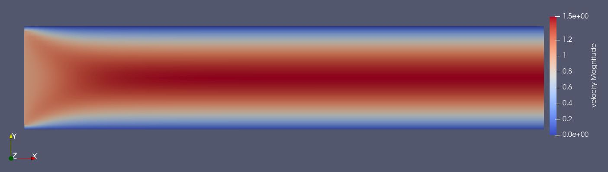

### b) The Karman Vortex Street:

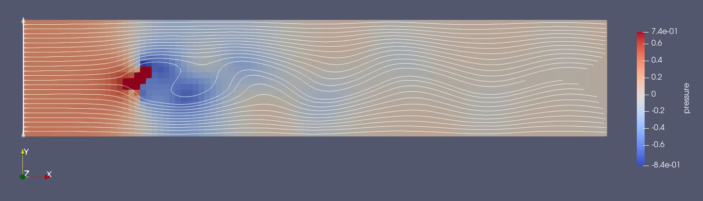

### c) Flow over a Step

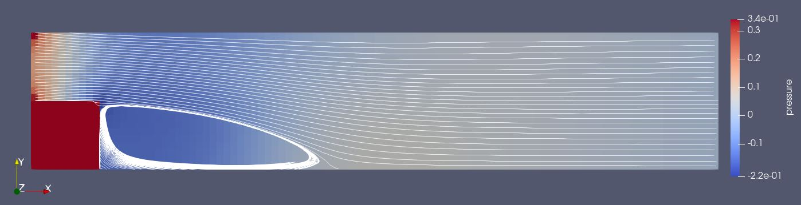

## 2 Energy Transport

### d) Natural Convection

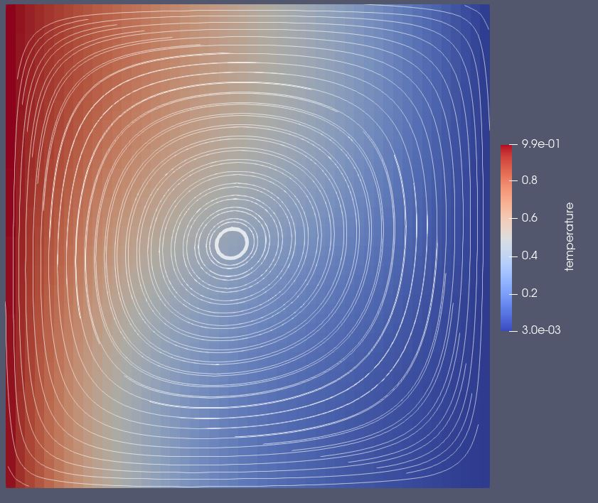
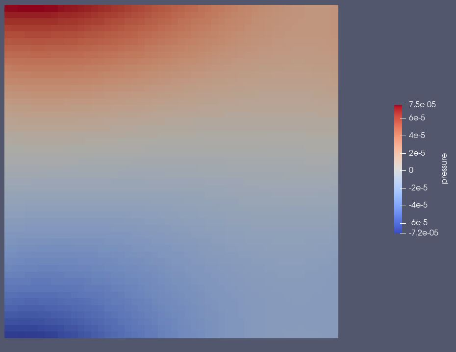

### Natural Convection with high Reynolds Number

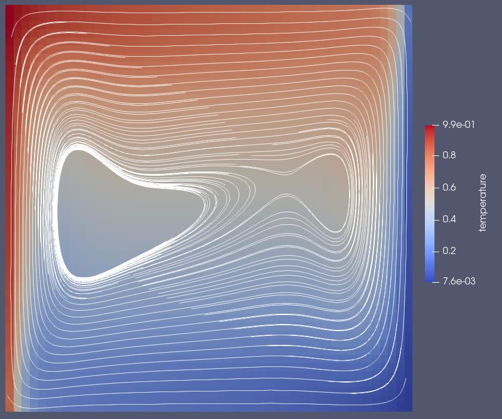
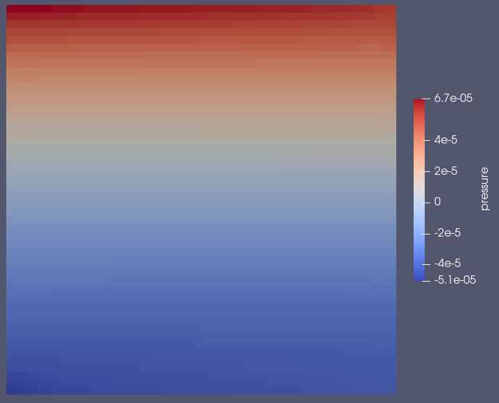

### e) Fluid Trap

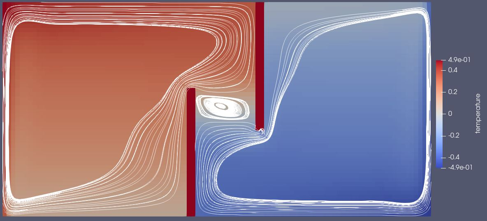
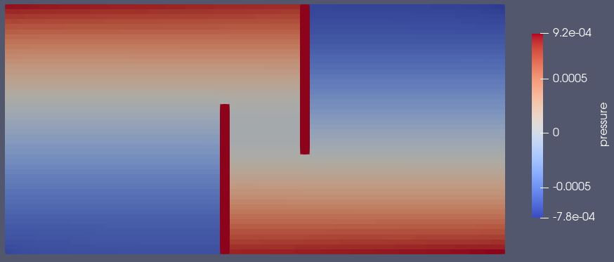

### Fluid Trap Hot and Cold Wall swapped

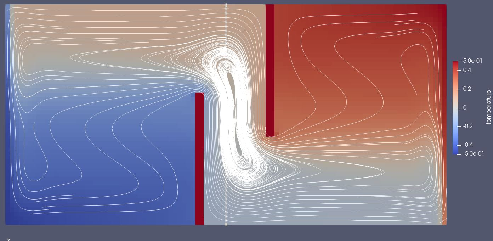
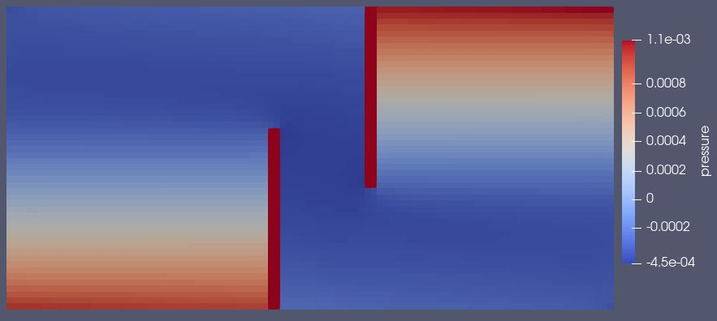

### f) Rayleigh-Bénard Convection

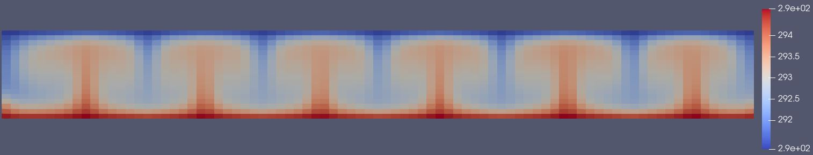
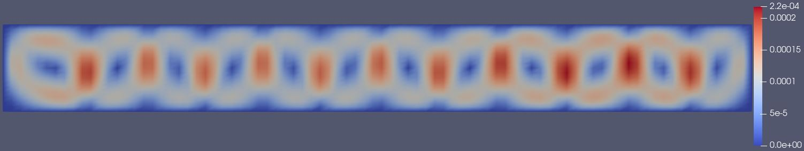
